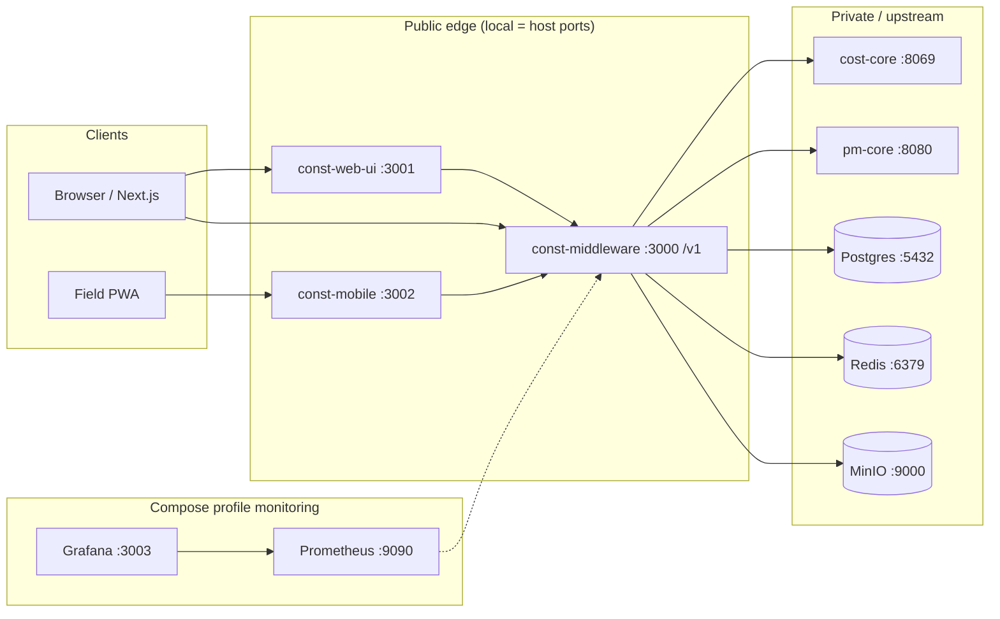

# Architecture overview — local ports (spec §3)

Customers talk **only** to the branded portal / PWA and the middleware `/v1` API. Upstream engines stay private.

## Topology (Mermaid)



## ASCII (laptop)

```
  [Browser] ----:3001----> const-web-ui (Next.js)
       |                         |
       +--------:3000----> const-middleware (/v1)
       |                         |
  [PWA :3002] --------------------+
                                 |
                    +------------+------------+
                    |            |            |
                 cost-core    pm-core      redis/minio/postgres
                   :8069       :8080      :6379 / :9000 / :5432
                                 |
                    (optional) prometheus:9090  grafana:3003
```

## Port map

| Component | Spec role | Local port |
|---|---|---|
| `const-middleware` | Branded API | **3000** (`/v1`) |
| `const-web-ui` | Portal | **3001** |
| `const-mobile` | Field PWA | **3002** |
| Grafana | Observability UI | **3003** |
| Prometheus | Metrics | **9090** |
| cost-core | OpenConstructionERP (or stand-in) | **8069** |
| pm-core | OpenProject API v3 (or stand-in) | **8080** |
| Redis | Queues / cache | **6379** |
| MinIO | Object storage | **9000** / console **9001** |
| Postgres | Compose support DB | **5432** |

## Namespaces (production intent)

| Namespace | Workloads |
|---|---|
| `prod-apps` | middleware, web-ui |
| `prod-upstream` | cost-core, pm-core (NetworkPolicy: middleware only) |

Local substitute: [const-infra/docker-compose.yml](../../const-infra/docker-compose.yml) — no cluster required.

## Isolation rule

Browsers never call `:8069` or `:8080`. Only middleware adapters do (`UPSTREAM_MODE=http`).
